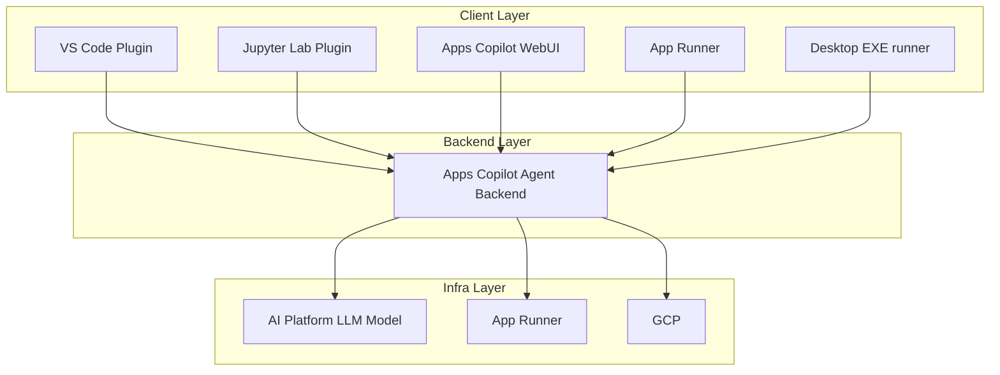

```mermaid
graph TD
    subgraph Client Layer
        A[VS Code Plugin]
        B[Jupyter Lab Plugin]
        C[Apps Copilot WebUI]
        D[App Runner]
        E[Desktop EXE runner]
    end

    subgraph Backend Layer
        F[Apps Copilot Agent Backend]
    end

    subgraph Infra Layer
        G[AI Platform LLM Model]
        H[App Runner]
        I[GCP]
    end

    A --> F
    B --> F
    C --> F
    D --> F
    E --> F

    F --> G
    F --> H
    F --> I
```